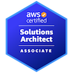

## Welcome to my Personal Blog!

My name is Nick, and I'm excited to share my thoughts and experiences with you.

As for me, I'm a Software Engineer, who enjoys reading anything.

I started this blog as a way to document my journey and share my insights with others.

On this blog, I'll be sharing tips and advice on technical stuffs:

  - Spring Boot
  - Angular
  - AWS
  - ...
            
...as well as personal stories.

So grab a cup of coffee or tea, settle in, and let's explore the world together! I'm so glad you're here.

#### Certifications:

